# Supermarket Kata

## Scenarios

| #   | Strategy                          | Input                 | Output |
|-----|-----------------------------------|-----------------------|--------|
| 1   | Unit pricing (Qty)                | 1 carton of Milk      | 5      |
| 2   | Unit pricing (Qty)                | 5 cartons of Milk     | 25     |
| 3   | Bulk pricing                      | 3 bars of chocolates  | 10     |
| 4   | Composite pricing (Unit and Bulk) | 15 bars of chocolates | 50     |
| 5   | Composite pricing (Unit and Bulk) | 2 bars of chocolates  | 8      |
| 6   | Unit pricing (Weight)             | 2 Kgs of Rice         | 10     |
| 7   | Unit pricing (Weight)             | 500 gms of Lentils    | 4      |  

## TDD Approach

1. Pick the simplest use case to test
2. The use case should be from an observable behaviour
3. A little modelling helps to get thoughts in order. Refer the thought process in figure below

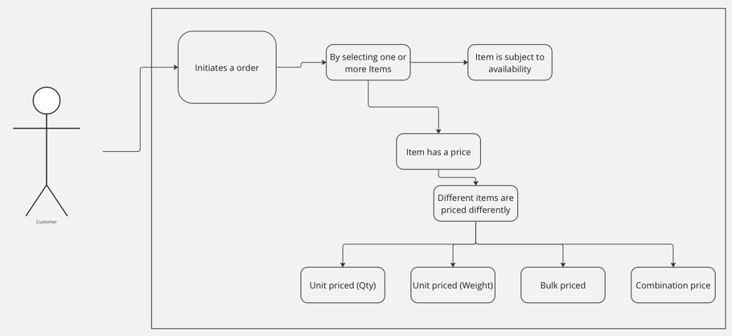

4. Start your code with the first simplistic test case from an observable point i.e. Order. Example below
5. Write the failing test case first (Compilation error is also a failure), and then implement the code.

First test case

```java
    @Test
public void test_SingleItemPurchase_At_UnitPrice(){
        Order myOrder=new Order();
        myOrder.add("Milk");
        assertEquals(new BigDecimal(5),myOrder.total());
        }
```

Order class

```java
public class Order {

    public Order() {
    }

    public void add(String item) {

        //TODO: No behaviour as yet
    }

    public BigDecimal total() {
        return new BigDecimal(5); //TODO: Hardcoded value
    }
}
```

6. Run the test. Hardcode the value in **total()** method to quickly get your test case passing
7. The trick to a good TDD is that safety is important. Every failing test should reach a passing state in the quickest
   way possible
8. Once a test passes, it should never fail
9. Refactor the Order class to fix TODO in total method with a real implementation from Item class

```java
public class Order {

    Item item;

    public Order() {
        item = new Item("Milk", new BigDecimal(5));
    }

    public void add(String item) {
        //TODO: No behaviour as yet
    }

    public BigDecimal total() {
        return item.getPrice();
    }
}


public class Item {

    private BigDecimal price;
    private String name;

    public Item(String name, BigDecimal price) {
        this.price = price;
        this.name = name;
    }

    public BigDecimal getPrice() {
        return price;
    }
}


```

10. Its important to note that while we added a new class above (Item) and changed code in Order class, the test case
    continues to cover all our changes with 100% code coverage and doesn't fail.

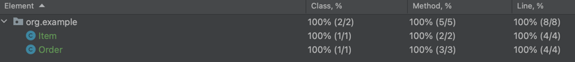

11. Now that we have established a basic behaviour, we have another TODO to add items to order. Start with a new test
    case.

```java
@Test
public void test_MultipleItemPurchase_At_UnitPrice(){
        Order myOrder=new Order();
        myOrder.add("Milk");
        myOrder.add("Milk");
        assertEquals(new BigDecimal(10),myOrder.total());
        }
```

12. The second test case will fail as we have fixed Order class with just one item in constructor with price of 5, and
    the test case expects a total of 10. Time to refactor the code
13. Implement the add functionality as below. Notice the change in Order class from before.

```java
public class Order {

    List<Item> items;

    public Order() {
        items = new ArrayList<>();
    }

    //TODO: Input parameter not in use
    public void add(String item) {

        items.add(new Item("Milk", new BigDecimal(5))); //TODO: Order should not decide the name and price of item
    }

    public BigDecimal total() {
        return items.stream().map(Item::getPrice).reduce(BigDecimal::add).orElse(BigDecimal.ZERO);
        //TODO: Returning ZERO in case of Optional result. Need to cover this case
    }
}
```

14. The add method has a behaviour now with a list of items.
15. The total method aggregates the prices from all the items in list.
    However, we might have introduced a new bug by return ZERO as default value for optional return. Any ideas in what
    cases it might be ZERO? There is only one way to find out. The next test.

```java
    @Test
public void test_EmptyOrder_Total(){
        Order myOrder=new Order();
        assertEquals(BigDecimal.ZERO,myOrder.total());
        }
```

16. With the total logic in Order, the only way the reducer won't have a aggregate is if the stream conditions don't
    yield any matching items, in which case there is nothing to pay and order value should be ZERO.
    The new test case passes right away. To validate your assumption, try to change the **orElse** part in total method
    to **BigDecimal.ONE**. The third test will fail.
17. Now its time to address our next set of TODOs in the add method. Yet again, we start by looking at our test cases.
    We have 3 tests so far, and I see some duplication.

```java
public class PricingTest {
    @Test
    public void test_SingleItemPurchase_At_UnitPrice() {
        Order myOrder = new Order();
        myOrder.add("Milk");
        assertEquals(new BigDecimal(5), myOrder.total());
    }

    @Test
    public void test_MultipleItemPurchase_At_UnitPrice() {
        Order myOrder = new Order();
        myOrder.add("Milk");
        myOrder.add("Milk");
        assertEquals(new BigDecimal(10), myOrder.total());
    }

    @Test
    public void test_EmptyOrder_Total() {
        Order myOrder = new Order();
        assertEquals(BigDecimal.ZERO, myOrder.total());
    }
}
```

18. I am initializing the Order instance in all tests separately. I can pull it out as a setup step with **@Before**
    annotation so that this steps repeats for all my tests henceforth.

```java
    Order myOrder;

@Before
public void setup(){
        myOrder=new Order();
        }
```

19. Now it's time to take a little leap. If you refer to the model diagram I created initially, the Order has a
    collection of Items, but should not create Items, instead Items belong to the Inventory, and our Order should check
    if a given item is present in Inventory to purchase.
    So, its time for us to introduce the concept of Inventory in our setup method.

```java
    Order myOrder;
        ItemInventory itemInventory;

@Before
public void setup(){
        itemInventory=new InMemoryItemInventory();
        itemInventory.add(new Item("Milk",new BigDecimal(5)));
        myOrder=new Order(itemInventory);
        }
```

20. I created an interface **ItemInventory** and implemented it with a Fake implementation named **InMemoryItemInventory
    ** as shown below

```java
public interface ItemInventory {
    void add(Item item);

    Item fetchItem(String item);
}

public class InMemoryItemInventory implements ItemInventory {

    List<Item> items;

    public InMemoryItemInventory() {
        items = new ArrayList<>();
    }

    @Override
    public void add(Item item) {
        items.add(item);
    }

    @Override
    public Item fetchItem(String inputItem) {
        return items.stream().filter(item -> item.getName().equals(inputItem)).findAny().orElseThrow(); //TODO: Catch exception if item is not found
    }
}
```

21. The next step is to inject the **inventory** reference in the Order class. And there goes all my TODOs for Order so
    far.

```java
public class Order {

    private final ItemInventory inventory;
    List<Item> items;

    public Order(ItemInventory itemInventory) {
        this.inventory = itemInventory;
        items = new ArrayList<>();
    }

    public void add(String itemToFind) {
        Item item = this.inventory.fetchItem(itemToFind);
        items.add(item);
    }

    public BigDecimal total() {
        return items.stream().map(Item::getPrice).reduce(BigDecimal::add).orElse(BigDecimal.ZERO);
    }
}
```

22. Btw, you might be thinking that I added a lot of code without any test cases in past 2 steps. Are the tests passing?
    Is my code coverage still 100%? Let's check

All tests are passing <br/>
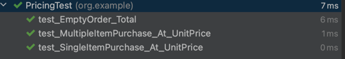

100% test coverage for the whole package<br/>
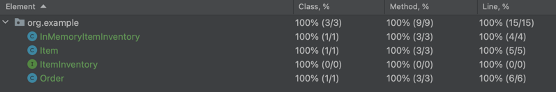

23. How is that possible? Because, our tests are testing the behaviour and not tied to the structure of code. Take a
    look at our test suite below. No tests have changed due to introduction of Inventory and internal Order logic
    change.

```java
public class PricingTest {

    Order myOrder;
    ItemInventory itemInventory;

    @Before
    public void setup() {
        itemInventory = new InMemoryItemInventory();
        itemInventory.add(new Item("Milk", new BigDecimal(5)));
        myOrder = new Order(itemInventory);
    }

    @Test
    public void test_SingleItemPurchase_At_UnitPrice() {
        myOrder.add("Milk");
        assertEquals(new BigDecimal(5), myOrder.total());
    }

    @Test
    public void test_MultipleItemPurchase_At_UnitPrice() {
        myOrder.add("Milk");
        myOrder.add("Milk");
        assertEquals(new BigDecimal(10), myOrder.total());
    }

    @Test
    public void test_EmptyOrder_Total() {
        assertEquals(BigDecimal.ZERO, myOrder.total());
    }

}
```

24. You might have noticed that when I added Inventory classes, I also introduced a new TODO in **fetchItem** method. If
    the item is found in inventory, the method should return that, else throw an exception.
    But we don't have a proper exception and even a test for exception. Oh boy, lets get it right away

**New Test** <br/>

```java
    @Test(expected = ItemNotFoundException.class)
public void test_InvalidItemPurchase_Exception(){
        myOrder.add("iPhone");
        }
```

**Exception class** <br/>

```java
public class ItemNotFoundException extends RuntimeException {
    public ItemNotFoundException(String format) {
        super(format);
    }
}
```

25. Meanwhile, I am just curious if we can add any other item apart from Milk to our order with a different price, and
    will it continue to work? Try it yourself. ;)
26. We have covered the first two scenarios from the list above. Now its time to move on to the next scenario (Bulk
    pricing). We currently fetch price from Item class, and by default its currently unit price.
    To introduce a different way of pricing, we need a way to segregate pricing strategies from Item in their own
    classes for sake of simplicity and extendability. Time to introduce **Strategy**.
    Let's start with our tests. We are initializing the Item instances in the setup method. One place to change only.

```java
    @Before
public void setup(){
        itemInventory=new InMemoryItemInventory();
        PricingStrategy unitPriceFiveMoney=new UnitPricingStrategy(new BigDecimal(5));
        PricingStrategy unitPriceThreeMoney=new UnitPricingStrategy(new BigDecimal(3));
        itemInventory.add(new Item("Milk",unitPriceFiveMoney));
        itemInventory.add(new Item("Bread",unitPriceThreeMoney));
        myOrder=new Order(itemInventory);
        }
```

28. Checkout line 2 and 3 in the setup method above. I intend to introduce PricingStrategy as a construct for creating
    different strategies that can be applied to each item.
29. Let's implement these classes and run our tests. Remember, the tests are still the same and they should continue to
    work.

The **PricingStrategy** interface defines the basic contract for Pricing

```java
public interface PricingStrategy {
    BigDecimal getPrice();
}
```

The **UnitPricingStrategy** class implemented the **PricingStrategy** interface

```java
public class UnitPricingStrategy implements PricingStrategy {

    private final BigDecimal price;

    public UnitPricingStrategy(BigDecimal price) {
        this.price = price;
    }


    @Override
    public BigDecimal getPrice() {
        return price;
    }
}
```

The Item class parameter type for price has changed to Pricing strategy, and getPrice method now fetches price from
strategy

```java
public class Item {
    private PricingStrategy pricingStrategy;
    private String name;

    public Item(String name, PricingStrategy strategy) {
        this.pricingStrategy = strategy;
        this.name = name;
    }

    public BigDecimal getPrice() {
        return pricingStrategy.getPrice();
    }

    public String getName() {
        return name;
    }
```

30. Time to run the tests. Remember, no tests have been changed. So, not only all tests should run, our coverage will
    continue to be 100%. Let's see.

**Unit tests**<br/>
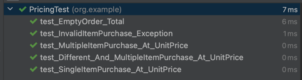

**Test coverage**<br/>
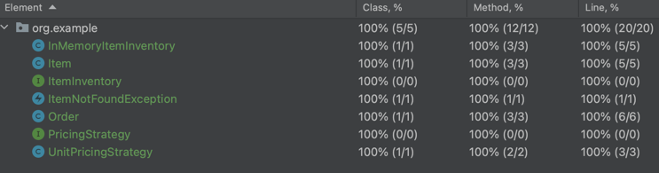

31. Now that we have introduced the strategy, its time to add new one for Bulk. We start with a new test case for new
    behaviour.

```java

//Insert below lines in existing setup method before injecting inventory to Order constructor
    PricingStrategy bulkPricingTenMoney=new BulkPricingStrategy(noOfChocolates,new BigDecimal(10));
            itemInventory.add(new Item("Chocolates",bulkPricingTenMoney));

//Add this test
@Test
public void test_MultipleItemPurchase_At_BulkPrice(){
        myOrder.add("Chocolates");
        myOrder.add("Chocolates");
        myOrder.add("Chocolates");
        assertEquals(new BigDecimal(10),myOrder.total());
        }
```

34. The test case fails as we don't have a logic for bulk pricing. Time to fix the issue in Order class. Let's look at *
    *total()** method. The current method aggregates prices for individual items. I suddenly see an issue with my logic.

```java
    public BigDecimal total(){
        return items.stream().map(Item::getPrice).reduce(BigDecimal::add).orElse(BigDecimal.ZERO);
        }
```

35. The above logic is biased towards unit pricing only with the way it adds price for each item to calculate total. By
    principle, it's not Order's responsibility to calculate what 2 cartons of milk are worth.
    The pricing strategy belongs to each Item, and given the strategy varies by quantity, all strategies need to know
    how much are we ordering. We need to refactor our code to replicate our new thinking

36. Let us start by observing Order's current structure and find any anomalies in our logic.
    1. Each time we add an item to Order's items collection, we fetch Item object from inventory. So, for 3 cartons of
       milk, I have 5 **Item** instances in **Order** class **items** collection

    ```java
    public void add(String itemToFind) {
            Item item = this.inventory.fetchItem(itemToFind);
            items.add(item);
        }
    ```

    2. Now here are few considerations
        1. Every time I fetch and add an Item instance to Order collection, I am consuming more memory to represent the
           Object (with Object header, and allocating memory to its internal data types)
        2. The bigger concern however is that I am creating a local copy of Item. So if in a world where prices change
           dynamically (e.g. Air tickets, Gold prices, Stock markets), my copy of Item and its price will immediately go
           stale
        3. The worse part, with dynamic pricing, for the same item I might have different prices at different times
           depending on when Item was added to Order.

37. We need to fix our logic and instead of pulling in the Item object. But first, we need to tackle our failing test
    for BulkPricing. Let us comment it for a few mins as we refactor the code with our new understanding.

```java
// TODO: Fix failing Test as Bulk pricing not defined
//    @Test
//    public void test_MultipleItemPurchase_At_BulkPrice(){
//        myOrder.add("Chocolates");
//        myOrder.add("Chocolates");
//        myOrder.add("Chocolates");
//        assertEquals(new BigDecimal(10), myOrder.total());
//    }
```

39. We have some good amount of refactoring to do. The key to refactoring while ensuring no regression, is to make small
    and safe change. We start with changing how **add** method works.
    Instead of adding item to the list of **items**, lets extract the name of item and add that instead. It forces us to
    change the list type from **Item** to **String**. Do that. It also impacts the **total** method.
    Earlier we were iterating through a list of **Item*, now that list is **String**, so to fetch the price for each
    Item we need to call **Inventory** again. Looks duplication, but lets do it anyway for now with a TODO added to our
    list.

```java
public class Order {

    private final ItemInventory inventory;
    List<String> items;

    public Order(ItemInventory itemInventory) {
        this.inventory = itemInventory;
        items = new ArrayList<>();
    }

    public void add(String itemToFind) {
        Item item = this.inventory.fetchItem(itemToFind);
        //Change: Changed collection type from Item to String to record name only
        //TODO: Record item reference instead of name
        //TODO: Name is also case sensitive. Fix it
        items.add(item.getName());
    }

    public BigDecimal total() {
        BigDecimal total = BigDecimal.ZERO;
        //TODO: The Order still calculates the price for each item (Forcing Unit pricing). The logic needs to be encapsulated away in Item class. Inventory called twice.
        for (String item : items) {
            total = total.add(this.inventory.fetchItem(item).getPrice());
        }
        return total;
    }
}
```

40. Run the tests. Everything should continue to pass.
41. Our next step is to address the way Order is influencing calculating the pricing, as it forces all prices to be
    calculated for each item and tightly coupled to idea of Unit pricing.
    Let's start by adding a new method to **ItemInventory** interface to **fetchPrice** based on itemName and quantity
    and implement in InMemoryItemInventory. Make changes in **total** method to call this new behaviour **fetchPrice**
    with hardcoded value 1 instead of **fetchItem**

**ItemInventory**

```java
public interface ItemInventory {
    void add(Item item);

    Item fetchItem(String item);

    //Change: New method added for fetching price based on Item name and quantity
    BigDecimal fetchPrice(String item, int quantity);
}
```

**InMemoryItemInventory**

```java
@Override
public BigDecimal fetchPrice(String item,int quantity){
        return this.fetchItem(item).getPrice();
        }
```

**Order**

```java
  public BigDecimal total(){
        BigDecimal total=BigDecimal.ZERO;
        //TODO: The Order still calculates the price for each item (Forcing Unit pricing). The logic needs to be encapsulated away in Item class
        for(String item:items){
        total=total.add(this.inventory.fetchPrice(item,1)); //TODO: Hardcoded 1 to comply with Order's current behaviour
        }
        return total;
        }
```

42. The inventory itself has no clue on how the pricing is calculated as that logic is encapsulated within *
    *PricingStrategy** for each **Item**. Let's propagate the new quantity field down to Item and pricing strategies so
    that the pricing logic can be isolated at one place.

**PricingStrategy interface**

```java
//Change: Add quantity as a parameter to all pricing strategies
public interface PricingStrategy {
    BigDecimal getPrice(int quantity);
}
```

**UnitPricingStrategy class**

```java
//Change: Implement the new getPrice and update the logic to calculate Unit price for the given quantity by multiplication
public BigDecimal getPrice(int quantity){
        return price.multiply(BigDecimal.valueOf(quantity));
        }
```

**Item class**

```java
//Change: Let the getPrice method accept quantity as parameter
public BigDecimal getPrice(int quantity){
        return pricingStrategy.getPrice(quantity);
        }
```

```java
@Override
public BigDecimal fetchPrice(String item,int quantity){
        //Change: Pass down the quantity to Item method **getPrice**
        return this.fetchItem(item).getPrice(quantity);
        }
```

43. Run all tests. Everything should continue to pass.
44. Now let's shift our focus to Order class which still interferes with how pricing is calculated. We need to aggregate
    the number of items added to List of **items**, and pass the **item name** and **quantity** to **inventory** to
    fetch the price
    Refactor the Order class to change List to HashMap

```java
public class Order {

    private final ItemInventory inventory;
    Map<String, Integer> items;

    public Order(ItemInventory itemInventory) {
        this.inventory = itemInventory;
        items = new HashMap<>();
    }

    //Change: If Item already exists, increment the quantity. If not, put a new record in the map.
    public void add(String itemToFind) {
        Item item = this.inventory.fetchItem(itemToFind);
        if (items.containsKey(item.getName())) {
            int currentCounter = items.get(item.getName());
            items.put(item.getName(), currentCounter + 1);
        } else
            //TODO: Record item reference instead of name
            items.put(item.getName(), 1);
    }

    //Change: Iterate through the map and pass the item name and quantity to the inventory fetchPrice method.
    public BigDecimal total() {
        BigDecimal total = BigDecimal.ZERO;
        for (Map.Entry<String, Integer> item : items.entrySet()) {
            total = total.add(this.inventory.fetchPrice(item.getKey(), item.getValue()));
        }
        return total;
    }

```

If you are interested to see what all has changed from previous version from Order, here is a view with Side by side
change

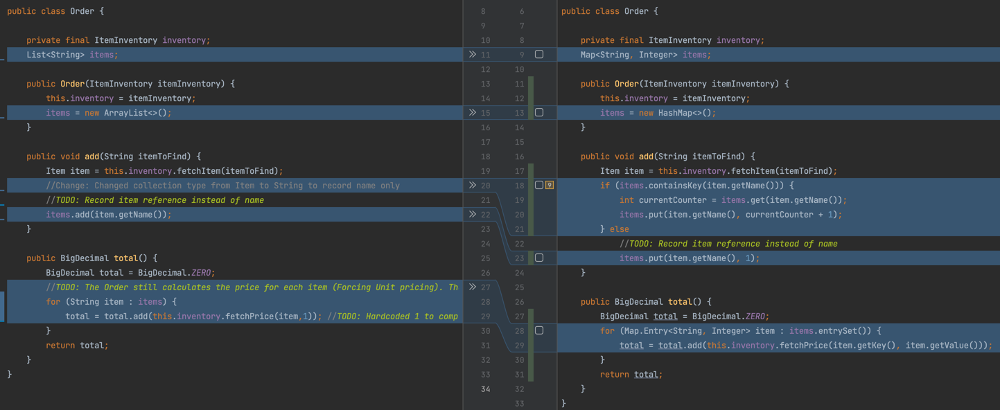

45. Run all tests. It should continue to pass.
46. Now its time for us to get back to our pending test case from Step 37. The Bulk pricing. Time to uncomment and fix
    it. If you have been following this guide step by step, you may find that as soon as you uncomment the test, it
    starts to pass automatically.<br/>
    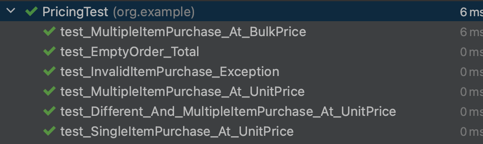

47. I missed a trick there. In hindsight, commenting the test case earlier allowed some black magic to happen. The
    reason it suddenly started working was because we decoupled the pricing from **Order** class and **BulkPriceStrategy
    ** already had a logic to return price.
    Lesson from practice. Never comment a test case or be ready for surprises.

```java
public class BulkPricingStrategy implements PricingStrategy {

    private final int applicableQuantity;
    private final BigDecimal price;

    public BulkPricingStrategy(int applicableQuantity, BigDecimal price) {
        this.applicableQuantity = applicableQuantity;
        this.price = price;
    }

    @Override
    public BigDecimal getPrice(int quantity) {
        return this.price;
    }
}
```

48. So, how do I fix my mistake? I am going to write another test case, where the Bulk pricing rule must fail.
    My new test checks that if I buy 2 or 4 chocolates instead of 3, the system should throw and *
    *InvalidPurchaseException**, because the bulk rule is only applicable for purchase of 3 items.

```java
@Test(expected = InvalidPurchaseException.class)
public void test_MultipleItemPurchase_At_BulkPrice_WithInvalidQuantity_ThrowsException(){
        myOrder.add("Chocolates");
        myOrder.add("Chocolates");
        assertEquals(new BigDecimal(10),myOrder.total());
        }

@Test(expected = InvalidPurchaseException.class)
public void test_MultipleItemPurchase_At_BulkPrice_WithMoreQuantity_ThrowsException(){
        myOrder.add("Chocolates");
        myOrder.add("Chocolates");
        myOrder.add("Chocolates");
        myOrder.add("Chocolates");
        assertEquals(new BigDecimal(4),myOrder.total());
        }
```

Our strategy defined in setup.

```java
    int noOfChocolates=3;
        PricingStrategy bulkPricingTenMoney=new BulkPricingStrategy(noOfChocolates,new BigDecimal(10));
```

49. Run all tests and see it pass. As always, with 100% coverage. One last scenario for us to work on. Imagine that we
    want some items to have a mixed strategy.
    For instance, we want Apples to be priced 1 for each piece, but if you buy 5, we want to bulk price it for 4. How to
    achieve this strategy? Our current strategy of handling bulk pricing is a bit flawed.
    Its not elegant and it doesn't end the flow gracefully and for unmatched quantities, it ends abruptly with
    exception. We can repurpose this behaviour for mixed strategy.
    Let's start with revisiting our exception test cases and code.

```java
@Test(expected = InvalidPurchaseException.class)
public void test_MultipleItemPurchase_At_BulkPrice_WithLessQuantity_ThrowsException(){
        myOrder.add("Chocolates");
        myOrder.add("Chocolates");
        assertEquals(new BigDecimal(10),myOrder.total());
        }

@Test(expected = InvalidPurchaseException.class)
public void test_MultipleItemPurchase_At_BulkPrice_WithMoreQuantity_ThrowsException(){
        myOrder.add("Chocolates");
        myOrder.add("Chocolates");
        myOrder.add("Chocolates");
        myOrder.add("Chocolates");
        assertEquals(new BigDecimal(4),myOrder.total());
        }
```

```java
public class BulkPricingStrategy implements PricingStrategy {

    private final int applicableQuantity;
    private final BigDecimal price;

    public BulkPricingStrategy(int applicableQuantity, BigDecimal price) {
        this.applicableQuantity = applicableQuantity;
        this.price = price;
    }

    @Override
    public BigDecimal getPrice(int quantity) {
        if (quantity != applicableQuantity)
            throw new InvalidPurchaseException(String.format("This item can only be purchased in quantities of %d", applicableQuantity));
        return this.price;
    }
}
```

50. We need ability to execute a composite strategy to account for Unit pricing as well as Bulk pricing. Using examples from the scenarios 4 and 5 above, if I buy 15 chocolates, I should get it for 50 (Bulk price*5 sets). 
Though, if I buy 2 chocolates, it should be priced at unit price, given its below the applicable quantity. Similarly, if I buy 16 chocolates, 15 should be priced at bulk, and 1 should be priced at unit pricing.
Let's start with our test cases.

I have updated the exception test cases from step 49, from asserting exceptions to asserting new behaviour. Please note this is the only time in this exercise that the test cases have changed, since the intended behaviour of the code needs to be changed.
```java
 @Test
    public void test_MultipleItemPurchase_At_BulkPrice_WithLessQuantity(){
        myOrder.add("Chocolates");
        myOrder.add("Chocolates");
        assertEquals(new BigDecimal(8), myOrder.total());
    }

    @Test
    public void test_MultipleItemPurchase_At_BulkPrice_WithMoreQuantity(){
        int numberOfChocolates = 16;
        for(int i=0;i<numberOfChocolates;i++){
            myOrder.add("Chocolates");
        }
        assertEquals(new BigDecimal(54), myOrder.total());
    }
```

And the implementation of **BulkPricingStrategy**

```java
public class BulkPricingStrategy extends UnitPricingStrategy {

    private final int applicableQuantity;
    private final BigDecimal price;

    public BulkPricingStrategy(int applicableQuantity, BigDecimal price, BigDecimal unitPrice) {
        super(unitPrice);
        this.applicableQuantity = applicableQuantity;
        this.price = price;
    }

    @Override
    public BigDecimal getPrice(int quantity) {
        int bulkPriceEligibleQty = Math.floorDiv(quantity, applicableQuantity);
        int unitPriceEligibleQty = quantity - applicableQuantity * bulkPriceEligibleQty;
        BigDecimal total = super.getPrice(unitPriceEligibleQty);
        return total.add(this.price.multiply(BigDecimal.valueOf(bulkPriceEligibleQty)));
    }
}
```

There are some changes to the implementation of this class. Instead of implementing the **PricingStrategy**, this class is now extending the default behaviour of **UnitPricingStrategy**.
The **getPrice** method now aggregates unit price and bulk price before it returns back the result. Here is the comparison of changes for your reference


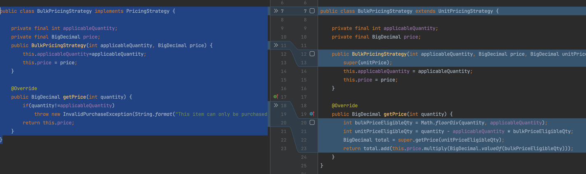


Now let's run all our test cases and also check our code coverage one last time

**All test cases**<br/> 
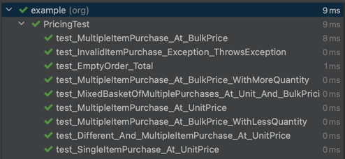


**All code coverage**<br/>
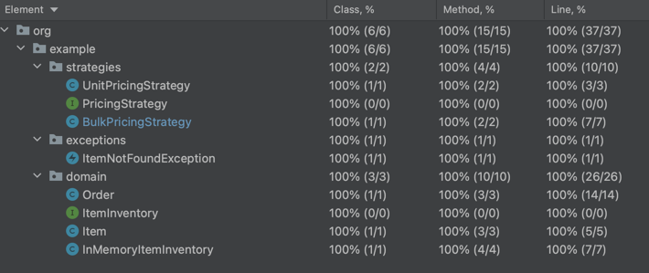


## Pending TODOs

There are still a lot of ways in which this program can be improved and extended

1. I haven't implemented scenarios 6 and 7. Use it as an activity for yourself, and I will be curious to learn how you implement it.
2. The price as BigDecimal is a code smell. It reeks of primitive obsession. And you can see how verbose it is to everytime create and work with decimals, when all you want to talk is Money (That's your hint)
3. There are potential negative cases that I haven't catered in this exercise to keep it specific and easy to follow.