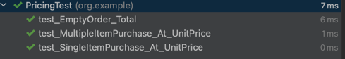
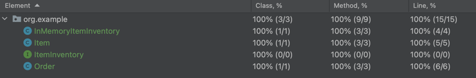
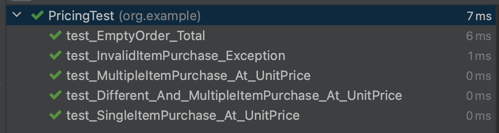

# Supermarket Kata


## Scenarios

| Strategy                          | Input                | Output    |
|-----------------------------------|----------------------|-----------|
| Unit pricing (Qty)                | 1 carton of Milk     | 5         |
| Unit pricing (Qty)                | 5 cartons of Milk    | 25        |
| Bulk pricing                      | 3 bars of chocolates | 10        |
| Bulk pricing                      | 1 bar of chocolates  | Exception |
| Composite pricing (Unit and Bulk) | 3 pies of cake       | 5         |
| Composite pricing (Unit and Bulk) | 1 pie of cake        | 2         |
| Unit pricing (Weight)             | 2 Kgs of Rice        | 10        |
| Unit pricing (Weight)             | 500 gms of Lentils   | 4         |  


## TDD Approach


1. Pick the simplest use case to test
2. The use case should be from an observable behaviour
3. A little modelling helps to get thoughts in order. Refer the thought process in figure below


4. Start your code with the first simplistic test case from an observable point i.e. Order. Example below
5. Write the failing test case first (Compilation error is also a failure), and then implement the code.

First test case
```java
    @Test
    public void test_SingleItemPurchase_At_UnitPrice() {
        Order myOrder = new Order();
        myOrder.add("Milk");
        assertEquals(new BigDecimal(5), myOrder.total());
    }
```

Order class
```java
public class Order {

    public Order() {
    }

    public void add(String item) {

        //TODO: No behaviour as yet
    }

    public BigDecimal total() {
        return new BigDecimal(5); //TODO: Hardcoded value
    }
}
```


6. Run the test. Hardcode the value in **total()** method to quickly get your test case passing
7. The trick to a good TDD is that safety is important. Every failing test should reach a passing state in the quickest way possible
8. Once a test passes, it should never fail
9. Refactor the Order class to fix TODO in total method with a real implementation from Item class

```java
public class Order {

    Item item;
    
    public Order() {
        item = new Item("Milk",new BigDecimal(5));
    }

    public void add(String item) {
        //TODO: No behaviour as yet
    }

    public BigDecimal total() {
        return item.getPrice();
    }
}


public class Item {
    
    private BigDecimal price;
    private String name;
    
    public Item(String name, BigDecimal price) {
        this.price = price;
        this.name = name;
    }

    public BigDecimal getPrice() {
        return price;
    }
}


```

10. Its important to note that while we added a new class above (Item) and changed code in Order class, the test case continues to cover all our changes with 100% code coverage and doesn't fail.


11. Now that we have established a basic behaviour, we have another TODO to add items to order. Start with a new test case.

```java
@Test
    public void test_MultipleItemPurchase_At_UnitPrice() {
        Order myOrder = new Order();
        myOrder.add("Milk");
        myOrder.add("Milk");
        assertEquals(new BigDecimal(10), myOrder.total());
    }
```

12. The second test case will fail as we have fixed Order class with just one item in constructor with price of 5, and the test case expects a total of 10. Time to refactor the code
13. Implement the add functionality as below. Notice the change in Order class from before.

```java
public class Order {

    List<Item> items;
    public Order() {
        items = new ArrayList<>();
    }
    
    //TODO: Input parameter not in use
    public void add(String item) {

        items.add(new Item("Milk",new BigDecimal(5))); //TODO: Order should not decide the name and price of item
    }

    public BigDecimal total() {
        return items.stream().map(Item::getPrice).reduce(BigDecimal::add).orElse(BigDecimal.ZERO);
        //TODO: Returning ZERO in case of Optional result. Need to cover this case
    }
}
```

14. The add method has a behaviour now with a list of items.
15. The total method aggregates the prices from all the items in list. 
However, we might have introduced a new bug by return ZERO as default value for optional return. Any ideas in what cases it might be ZERO? There is only one way to find out. The next test.

```java
    @Test
    public void test_EmptyOrder_Total(){
        Order myOrder = new Order();
        assertEquals(BigDecimal.ZERO, myOrder.total());
    }
```

16. With the total logic in Order, the only way the reducer won't have a aggregate is if the stream conditions don't yield any matching items, in which case there is nothing to pay and order value should be ZERO. 
The new test case passes right away. To validate your assumption, try to change the **orElse** part in total method to **BigDecimal.ONE**. The third test will fail.
17. Now its time to address our next set of TODOs in the add method. Yet again, we start by looking at our test cases. We have 3 tests so far, and I see some duplication.

```java
public class PricingTest {
    @Test
    public void test_SingleItemPurchase_At_UnitPrice() {
        Order myOrder = new Order();
        myOrder.add("Milk");
        assertEquals(new BigDecimal(5), myOrder.total());
    }

    @Test
    public void test_MultipleItemPurchase_At_UnitPrice() {
        Order myOrder = new Order();
        myOrder.add("Milk");
        myOrder.add("Milk");
        assertEquals(new BigDecimal(10), myOrder.total());
    }

    @Test
    public void test_EmptyOrder_Total(){
        Order myOrder = new Order();
        assertEquals(BigDecimal.ZERO, myOrder.total());
    }
}
```
18. I am initializing the Order instance in all tests separately. I can pull it out as a setup step with **@Before** annotation so that this steps repeats for all my tests henceforth.

```java
    Order myOrder;

    @Before
    public void setup(){
        myOrder = new Order();
    }
```

19. Now it's time to take a little leap. If you refer to the model diagram I created initially, the Order has a collection of Items, but should not create Items, instead Items belong to the Inventory, and our Order should check if a given item is present in Inventory to purchase.
So, its time for us to introduce the concept of Inventory in our setup method.

```java
    Order myOrder;
    ItemInventory itemInventory;

    @Before
    public void setup(){
        itemInventory = new InMemoryItemInventory();
        itemInventory.add(new Item("Milk",new BigDecimal(5)));
        myOrder = new Order(itemInventory);
    }
```

20. I created an interface **ItemInventory** and implemented it with a Fake implementation named **InMemoryItemInventory** as shown below

```java
public interface ItemInventory {
    void add(Item item);

    Item fetchItem(String item);
}

public class InMemoryItemInventory implements ItemInventory {

    List<Item> items;

    public InMemoryItemInventory(){
        items = new ArrayList<>();
    }
    @Override
    public void add(Item item) {
        items.add(item);
    }

    @Override
    public Item fetchItem(String inputItem) {
        return items.stream().filter(item->item.getName().equals(inputItem)).findAny().orElseThrow(); //TODO: Catch exception if item is not found
    }
}
```

21. The next step is to inject the **inventory** reference in the Order class. And there goes all my TODOs for Order so far.

```java
public class Order {

    private final ItemInventory inventory;
    List<Item> items;

    public Order(ItemInventory itemInventory) {
        this.inventory = itemInventory;
        items = new ArrayList<>();
    }

    public void add(String itemToFind) {
        Item item = this.inventory.fetchItem(itemToFind);
        items.add(item);
    }

    public BigDecimal total() {
        return items.stream().map(Item::getPrice).reduce(BigDecimal::add).orElse(BigDecimal.ZERO);
    }
}
```

22. Btw, you might be thinking that I added a lot of code without any test cases in past 2 steps. Are the tests passing? Is my code coverage still 100%? Let's check

All tests are passing <br/>


100% test coverage for the whole package<br/>


23. How is that possible? Because, our tests are testing the behaviour and not tied to the structure of code. Take a look at our test suite below. No tests have changed due to introduction of Inventory and internal Order logic change.

```java
public class PricingTest {

    Order myOrder;
    ItemInventory itemInventory;

    @Before
    public void setup() {
        itemInventory = new InMemoryItemInventory();
        itemInventory.add(new Item("Milk", new BigDecimal(5)));
        myOrder = new Order(itemInventory);
    }

    @Test
    public void test_SingleItemPurchase_At_UnitPrice() {
        myOrder.add("Milk");
        assertEquals(new BigDecimal(5), myOrder.total());
    }

    @Test
    public void test_MultipleItemPurchase_At_UnitPrice() {
        myOrder.add("Milk");
        myOrder.add("Milk");
        assertEquals(new BigDecimal(10), myOrder.total());
    }

    @Test
    public void test_EmptyOrder_Total() {
        assertEquals(BigDecimal.ZERO, myOrder.total());
    }

}
```

24. You might have noticed that when I added Inventory classes, I also introduced a new TODO in **fetchItem** method. If the item is found in inventory, the method should return that, else throw an exception. 
But we don't have a proper exception and even a test for exception. Oh boy, lets get it right away

**New Test** <br/>
```java
    @Test(expected =  ItemNotFoundException.class)
    public void test_InvalidItemPurchase_Exception(){
            myOrder.add("iPhone");
    }
```

**Exception class** <br/>
```java
public class ItemNotFoundException extends RuntimeException {
    public ItemNotFoundException(String format) {
        super(format);
    }
}
```

25. Meanwhile, I am just curious if we can add any other item apart from Milk to our order with a different price, and will it continue to work? Try it yourself. ;)
26. We have covered the first two scenarios from the list above. Now its time to move on to the next scenario (Bulk pricing). We currently fetch price from Item class, and by default its currently unit price. 
To introduce a different way of pricing, we need a way to segregate pricing strategies from Item in their own classes for sake of simplicity and extendability. Time to introduce **Strategy**. 
Let's start with our tests. We are initializing the Item instances in the setup method. One place to change only.


```java
    @Before
    public void setup(){
        itemInventory = new InMemoryItemInventory();
        PricingStrategy unitPriceFiveMoney = new UnitPricingStrategy(new BigDecimal(5));
        PricingStrategy unitPriceThreeMoney = new UnitPricingStrategy(new BigDecimal(3));
        itemInventory.add(new Item("Milk",unitPriceFiveMoney));
        itemInventory.add(new Item("Bread",unitPriceThreeMoney));
        myOrder = new Order(itemInventory);
    }
```

28. Checkout line 2 and 3 in the setup method above. I intend to introduce PricingStrategy as a construct for creating different strategies that can be applied to each item.
29. Let's implement these classes and run our tests. Remember, the tests are still the same and they should continue to work.


The **PricingStrategy** interface defines the basic contract for Pricing
```java
public interface PricingStrategy {
    BigDecimal getPrice();
}
```

The **UnitPricingStrategy** class implemented the **PricingStrategy** interface
```java
public class UnitPricingStrategy implements PricingStrategy {

    private final BigDecimal price;
    public UnitPricingStrategy(BigDecimal price) {
        this.price = price;
    }


    @Override
    public BigDecimal getPrice() {
        return price;
    }
}
```

The Item class parameter type for price has changed to Pricing strategy, and getPrice method now fetches price from strategy
```java
public class Item {
    private PricingStrategy pricingStrategy;
    private String name;
    public Item(String name, PricingStrategy strategy) {
        this.pricingStrategy = strategy;
        this.name = name;
    }

    public BigDecimal getPrice() {
        return pricingStrategy.getPrice();
    }

    public String getName() {
        return name;
    }
```

30. Time to run the tests. Remember, no tests have been changed. So, not only all tests should run, our coverage will continue to be 100%. Let's see.




